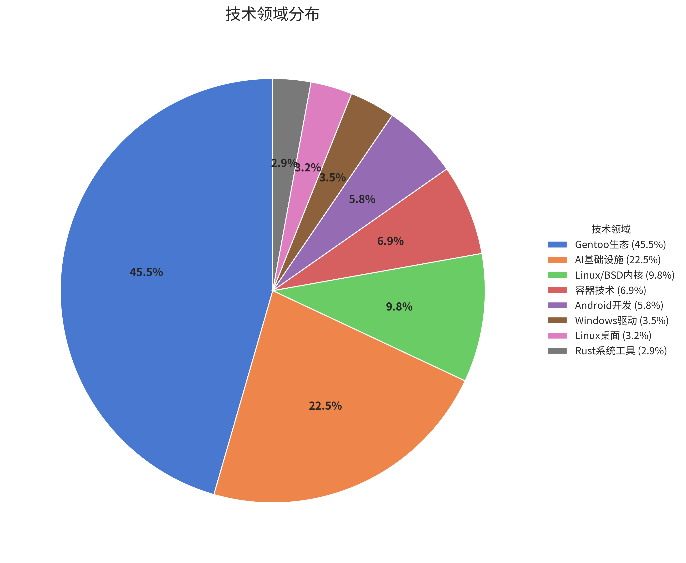
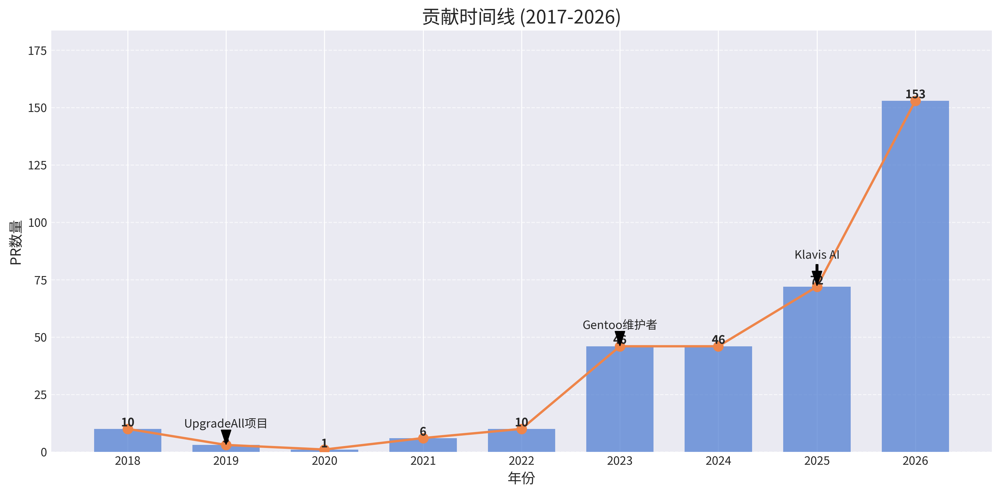
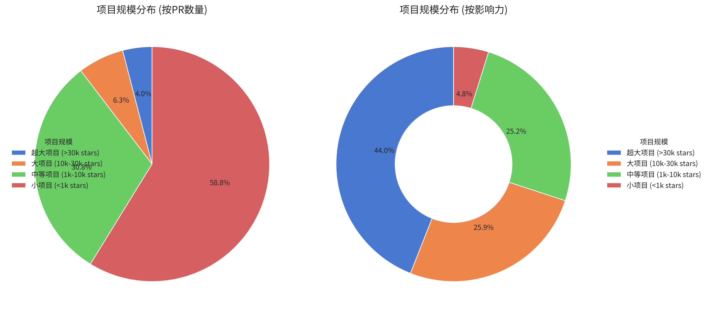
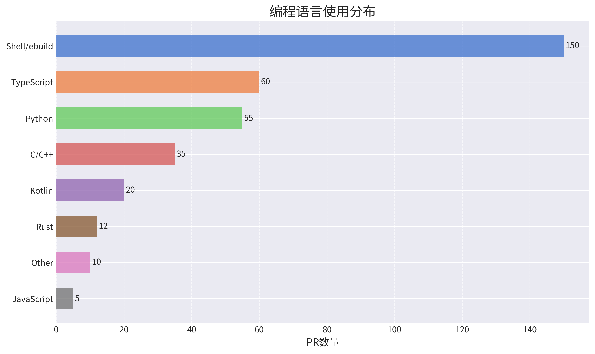
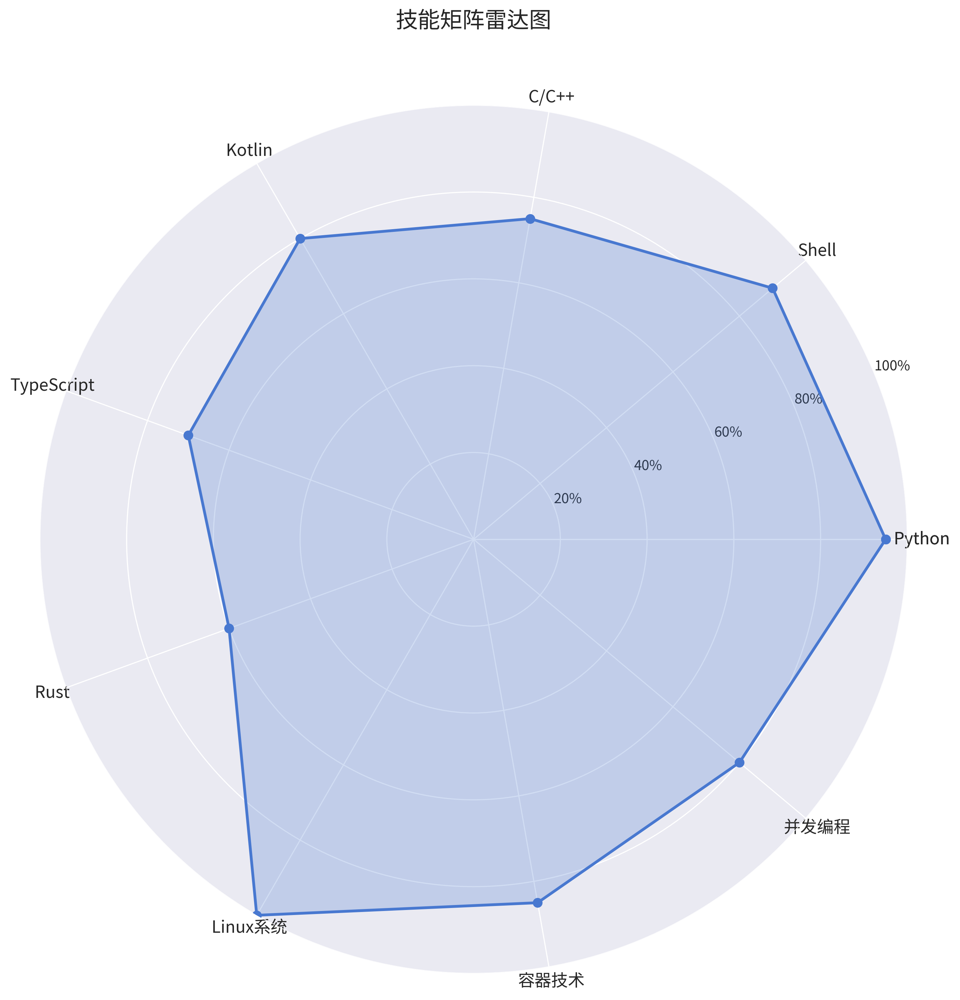

# xz-dev 开源贡献 Wiki

> **最后更新**: 2026-06-10
> **数据来源**: GitHub CLI/API + 人工整理 + 本地 wiki
> **PR 时间跨度**: 2018-2026 (9年)；博客/社区内容可追溯至 2017

---

## 📊 贡献概览

### 核心数据

| 指标 | 数值 | 说明 |
|------|------|------|
| **总 PR 数量** | 347 | GitHub CLI 公开 PR 统计，含 open/closed/merged |
| **公开贡献仓库数** | 81 | 涉及的不同 GitHub 仓库 |
| **总 Stars** | 805,000+ | 贡献项目累计 stars，受 hermes-agent / Home Assistant / MCP Servers / Magisk / rclone 等大项目拉动 |
| **活跃年限** | 9年 | 2018-2026 持续贡献；博客/社区内容可追溯到 2017 |
| **2026 PR 数** | 153 | 截至 2026-06-10，112 已合并 / 15 开放 / 26 关闭 |
| **当前画像** | AI agent infrastructure + Linux/Gentoo 系统工程 | 见 [CURRENT_PROFILE.md](./CURRENT_PROFILE.md) |

### 项目规模分布

```
超大项目 (>30k ⭐):  8仓库 / 14 PR  - hermes-agent, Home Assistant, MCP Servers, Magisk, rclone, LiteLLM等
大项目 (10k-30k ⭐):  7仓库 / 22 PR  - SillyTavern, distrobox, grpc-rust, LibreTube等
中等项目 (1k-10k ⭐): 21仓库 / 107 PR - freebsd-src, OmniRoute, Honcho, flatpak, virtio-win等
小项目 (<1k ⭐):    45仓库 / 204 PR - Gentoo生态、个人项目、输入/桌面工具等
```

### 技术领域分布

- 🎯 **Gentoo/包维护** (~45%) - opencode-bin、anytype-bin、lceda-pro、OpenRC、Portage、overlay 维护
- 🤖 **AI基础设施 / Agent** (~22%) - Hermes、Honcho、Hindsight、APISIX gateway、OmniRoute、MCP、SillyTavern、guardrails
- 🐧 **Linux/BSD系统** (~10%) - Linux 内核、FreeBSD virtio_balloon、amdgpu MST、flatpak、reframe
- 🐳 **容器技术** (~7%) - Podman、Docker、distrobox、MCP 容器部署
- 📱 **Android / Rust 工具** (~8%) - UpgradeAll、libversion-sys、hid-rgb-ctl
- 🪟 **Windows驱动 / 桌面输入** (~8%) - VirtIO GPU、python-evdev、numlockw、Linux desktop fixes



---

## 🗂️ Wiki 导航

### 当前个人画像

- [🧭 当前画像](./CURRENT_PROFILE.md) - 职业定位、AI 基础设施、工程风格和与旧版 wiki 的差异

### 按年份浏览

快速了解技术成长路径和贡献演进：

- [📅 2018年](./by-year/2018.md) - GitHub起步，Android开发
- [📅 2019年](./by-year/2019.md) - UpgradeAll项目创立
- [📅 2020年](./by-year/2020.md) - Android生态深耕
- [📅 2021年](./by-year/2021.md) - 系统工具开发
- [📅 2022年](./by-year/2022.md) - Linux系统探索
- [📅 2023年](./by-year/2023.md) - Gentoo维护者
- [📅 2024年](./by-year/2024.md) - 系统底层探索
- [📅 2025年](./by-year/2025.md) - Klavis AI (MCP基础设施)
- [📅 2026年](./by-year/2026.md) - AI agent 基础设施、APISIX/OmniRoute/Hermes/Honcho、Gentoo 高频维护、VirtIO/FreeBSD/桌面长尾修复



### 按项目规模浏览

展示影响力层次：

- [🏆 超大项目 (>30k ⭐)](./by-scale/mega-projects.md) - MCP Servers, LibreChat
- [🔥 大项目 (10k-30k ⭐)](./by-scale/large-projects.md) - distrobox, SillyTavern
- [💡 中等项目 (1k-10k ⭐)](./by-scale/medium-projects.md) - virtio-win, gentoo, ansible-runner等
- [📦 小项目 (<1k ⭐)](./by-scale/small-projects.md) - 204 PR 汇总



### 按技术领域浏览

深入技术细节：

- [🐧 Linux内核与驱动](./by-domain/linux-kernel.md) - 内核补丁、调度器、AutoFDO
- [🪟 Windows驱动开发](./by-domain/windows-drivers.md) - VirtIO GPU驱动系列
- [🐳 容器技术](./by-domain/container-tech.md) - distrobox, Podman, cgroup
- [🤖 AI基础设施](./by-domain/ai-infrastructure.md) - MCP协议、Hermes/Honcho/Hindsight、APISIX gateway、OmniRoute、guardrails
- [📱 Android生态](./by-domain/android.md) - UpgradeAll, NewPipe, bilimiao2
- [🎯 Gentoo生态](./by-domain/gentoo-ecosystem.md) - 150+ ebuild/overlay 维护, opencode-bin, anytype-bin, CachyOS kernels

### 重点项目深度分析

核心贡献的详细技术解析：

- [🔍 MCP Servers - 跨进程文件锁](./deep-dive/mcp-servers.md) - 解决多实例数据损坏问题
- [🔍 VirtIO GPU Driver - 8K分辨率支持](./deep-dive/virtio-gpu-driver.md) - 修复BSOD并支持HDR
- [🔍 distrobox - cgroup委托问题](./deep-dive/distrobox-contributions.md) - PID命名空间隔离
- [🔍 SillyTavern ChatBot-Proxy - AI虚拟伴侣通信系统](./deep-dive/sillytavern-chatbot-proxy.md) - 双端桥接架构 + 多平台适配
- [🔍 UpgradeAll - Android更新系统](./deep-dive/upgradeall-project.md) - AGP 9.0 现代化 + Rust getter 统一架构
- [💬 GitHub Issues 互动分析](./deep-dive/github-issues-analysis.md) - 纯语言解决问题能力 **(评分91.3/100)**
- [🌐 网站与社区贡献分析](./deep-dive/websites/README.md) - 博客 (xzos.net, 55+文章), Stack Exchange (6平台), Mastodon (FOSS社区)
- [📚 Linux Wiki 贡献深度分析](./deep-dive/websites/linux-wiki-contributions.md) - Arch Wiki (29编辑) + Gentoo Wiki (35编辑) **(评分92.4/100)**

### 个人项目详解

自主开发的开源工具：

- [📦 distrobox-plus](./personal-projects/distrobox-plus.md) - Python重写distrobox (⭐11)
- [📦 numlockw](./personal-projects/numlockw.md) - NumLock控制工具 (⭐13)
- [📦 AdGuardHome-LogSync](./personal-projects/adguardhome-logsync.md) - 日志同步工具 (⭐4)
- [📦 SillyTavern-ChatBot-Proxy](./personal-projects/sillytavern-chatbot-proxy.md) - AI虚拟伴侣异步通信系统
- [📦 hid-rgb-ctl](./personal-projects/hid-rgb-ctl.md) - Linux HID RGB灯光控制工具
- [📦 kernel-autofdo-container](./personal-projects/kernel-autofdo-container.md) - 内核优化工具 (⭐3)
- [📦 gentoo-ai-update-repo](./personal-projects/gentoo-ai-update-repo.md) - AI 驱动的 Gentoo ebuild 自动更新
- [📦 APISIX AI Gateway Config](https://github.com/xz-dev/apisix-ai-gateway-config) / [Hermes APISIX Provider](https://github.com/xz-dev/hermes-apisix-provider) - 本地模型网关配置与 Hermes provider 插件
- [📦 TelegramFileUploader](./personal-projects/telegram-file-uploader.md) - GitHub Action + CLI Telegram 上传工具

---

## 🔍 快速检索

### 按技术栈查找

| 技术栈 | 相关项目/PR |
|--------|------------|
| **Python** | distrobox-plus, AdGuardHome-LogSync, MCP服务器, UpgradeAll |
| **C/C++** | VirtIO GPU驱动, 内核补丁, DisplayCAL |
| **Kotlin** | UpgradeAll, TestSelf, bilimiao2 |
| **Shell/ebuild** | Gentoo ebuilds, OpenRC服务, distrobox |
| **TypeScript** | MCP Servers, Klavis项目, Hermes/OmniRoute/WebUI, SillyTavern |
| **Rust** | hid-rgb-ctl, libversion-sys, UpgradeAll getter |



### 按问题类型查找

| 问题类型 | 代表性PR |
|---------|---------|
| **并发/竞态条件** | [MCP文件锁](./deep-dive/mcp-servers.md), [VirtIO GPU BSOD修复](./deep-dive/virtio-gpu-driver.md) |
| **性能优化** | [内核AutoFDO](./personal-projects/kernel-autofdo-container.md), [distrobox初始化优化](./deep-dive/distrobox-contributions.md) |
| **架构设计** | [MCP进程隔离](./by-year/2025.md#q3-7月-9月), [UpgradeAll模块化](./deep-dive/upgradeall-project.md) |
| **兼容性修复** | [Gradle 9支持](./by-year/2024.md), [GCC 14/15编译修复](./by-domain/gentoo-ecosystem.md) |
| **功能实现** | [NewPipe评论回复](./by-domain/android.md), [bilimiao2倍速播放](./by-domain/android.md) |

### 按系统层级查找

- **内核层** - [Linux内核补丁](./by-domain/linux-kernel.md), [调度器](./by-domain/linux-kernel.md), [Windows驱动](./by-domain/windows-drivers.md)
- **系统层** - [cgroup](./deep-dive/distrobox-contributions.md), [PID namespace](./by-year/2026.md), [文件锁](./deep-dive/mcp-servers.md), [OpenRC](./by-domain/gentoo-ecosystem.md)
- **用户层** - [容器管理](./by-domain/container-tech.md), [MCP服务器](./by-scale/mega-projects.md), [桌面工具](./personal-projects/numlockw.md)
- **应用层** - [Android应用](./by-domain/android.md), [浏览器扩展](./by-year/2025.md), [CLI工具](./personal-projects/adguardhome-logsync.md)

### 交叉引用

查看各项贡献之间的关联和技术能力的延续性：

- [📋 贡献交叉引用表](./CROSS_REFERENCES.md) - 按主题、技术能力和时间线展示关联

---

## 📈 技能矩阵

### 编程语言熟练度

```
Python      ████████████████████ 95% (系统工具, MCP, 自动化)
Shell       ███████████████████░ 90% (Gentoo, 系统管理)
C/C++       ███████████████░░░░░ 75% (内核, Windows驱动)
Kotlin      ████████████████░░░░ 80% (Android应用)
TypeScript  ██████████████░░░░░░ 70% (Node.js, MCP)
Rust        ████████████░░░░░░░░ 60% (系统工具, 学习中)
```



### 技术领域深度

```
Linux系统管理  ████████████████████ 100% (RHCE认证)
容器技术      █████████████████░░░  85% (Podman, distrobox贡献者)
并发编程      ████████████████░░░░  80% (跨进程锁, IPC设计)
内核开发      ███████████████░░░░░  75% (调度器优化, CachyOS)
Windows驱动   ████████████░░░░░░░░  60% (VirtIO GPU驱动修复)
Android开发   ███████████████░░░░░  75% (UpgradeAll创始人)
AI基础设施    ██████████████████░░  90% (MCP, Hermes/Honcho, APISIX gateway, OmniRoute)
```

### 核心工程素养

**复杂场景长尾问题定位**

| 案例 | 表面现象 | 实际根因层级 | 诊断跨度 |
|------|---------|-------------|---------|
| [zram-init #57](./by-domain/gentoo-ecosystem.md) | KDE Plasma Wayland 死锁 | OpenRC 服务依赖方向错误 | 桌面环境 → Xwayland → 挂载点遮蔽 → init 系统 |
| [VirtIO GPU #1473](./by-domain/windows-drivers.md) | 分辨率切换 BSOD 0x3B | 错误路径使用 `m_pSegment` 而非参数 `pSegment` | Windows 蓝屏 → WinDbg → 单字符修复 |
| [VirtIO GPU #1536](./deep-dive/virtio-gpu-driver.md) | 超高分辨率分配失败 | WDDM CommitVidPn 无法安全回滚 + 2MB large page 碎片悬崖 | 驱动层 → Windows 内存管理器 → VirtIO 协议 |
| [distrobox #985/#1982](./deep-dive/distrobox-contributions.md) | 容器 stop 超时/僵尸进程 | cgroup v2 delegation 未配置 | 容器运行时 → cgroup → init 系统 → 跨 3 发行版 |
| [MCP Servers #3286](./deep-dive/mcp-servers.md) | 多实例数据损坏 | in-memory lock 无法跨 stdio 进程 | 应用层 → 进程模型 → 文件锁协议 |
| [SillyTavern #5333](./by-scale/large-projects.md) | TTS/图片扩展全部失效 | `.toString()` 导致 `instanceof Error` 成为死代码 | 扩展层 → 事件系统 → 错误处理路径 |

**AI 智能体全栈开发**

| 层级 | 实践 | 项目 |
|------|------|------|
| 应用架构 | 设计双端桥接系统 (浏览器扩展 ↔ WebSocket ↔ 服务端) | [ChatBot-Proxy](./deep-dive/sillytavern-chatbot-proxy.md) |
| LLM 前端 | 修复 streaming tool call 链、TTS 事件管线 | SillyTavern (29k+ Stars) |
| 模型网关 | APISIX AI gateway 替代 LiteLLM，provider 能力上游优先发现 | APISIX / Hermes provider / OmniRoute |
| 记忆系统 | Honcho 作为 memory provider，Hindsight 作为 MCP cognitive memory | Honcho / Hindsight / Hermes |
| Guardrails | 分阶段目标契约、工具调用审计、路径访问误报修复 | OpenClaw / pi-guardrails |
| 工具协议 | 解决 MCP stdio transport 跨进程并发问题 | MCP Servers (86k+ Stars) |
| 音频管线 | TTS 转发 + ffmpeg 转码 + STT (Groq/Whisper) 集成 | ChatBot-Proxy |
| 演进规划 | pipecat 集成路线：异步通信 → 实时语音/视频通话 → AI 自主调度 | 下一阶段 |

**工程习惯：调研优先，复用生态**

| 决策场景 | 选择 | 而非 | 收益 |
|---------|------|------|------|
| 多平台机器人适配 | Koishi + Satori 协议抽象 | 自己实现各平台 API | 单一代码支持 5+ 平台 |
| 跨进程文件锁 | proper-lockfile (4 方案对比后选定) | 自研锁协议 | 经过社区验证的可靠方案 |
| HID RGB 设备发现 | 解析 HID report descriptor (USB HID v1.4 规范) | 硬编码 VID/PID | 自动支持所有合规设备 |
| 帧缓冲块大小 | 研究 Segment Heap + buddy system 后选定 1MB | 凭经验选择 | 避开 2MB large page 碎片悬崖 |
| AyuGram 构建修复 | 参考官方 telegram-desktop ebuild | 从零调试构建系统 | 复用已验证的 minizip-ng 方案 |

---

## 🎯 使用指南

### 如何阅读这个 Wiki

1. **快速浏览**: 从 [按项目规模](./by-scale/) 开始，了解影响力分布
2. **技术深度**: 阅读 [重点项目深度分析](./deep-dive/) 了解核心技术
3. **时间线**: 按 [年份](./by-year/) 浏览，了解技术成长路径
4. **领域专精**: 按 [技术领域](./by-domain/) 深入特定方向
5. **可视化**: 查看 [visualization](./visualizations/) 目录下的图表直观了解

### 给 AI 助手的提示

如果你是 AI 助手，想要分析这个 Wiki：

1. 📖 **必读**: [HOW_TO_ANALYZE.md](./HOW_TO_ANALYZE.md) - 分析方法指南
2. 📊 **数据源**: [metadata.json](./metadata.json) - 结构化数据
3. 🔍 **检索技巧**: 使用 `grep -r "关键词" wiki/` 快速查找
4. 📈 **生成报告**: 基于 metadata.json 可自动生成统计报告

### 数据更新与可视化

- **拉取GitHub数据**: 运行 `./scripts/generate_wiki.sh --update-all`
- **生成可视化图表**: 运行 `./scripts/generate_visualizations.py`
- **覆盖率报告**: 运行 `./scripts/coverage.sh`
- **本地验证**: 运行 `./scripts/validate.sh`
- **按年份/领域更新**: `--update-year` / `--update-domain` 当前为保留入口；会复用既有数据并提示未实现，不会覆盖手工内容
- **手动修改**: 直接编辑相应的 markdown 文件

---

## 🔗 外部链接

### 代码平台
- **GitHub**: [https://github.com/xz-dev](https://github.com/xz-dev)
- **GitLab**: [https://gitlab.com/xz-dev](https://gitlab.com/xz-dev)
- **Codeberg**: [https://codeberg.org/xz-dev](https://codeberg.org/xz-dev)

### 个人博客与简历
- **技术博客**: [https://xzos.net/](https://xzos.net/) - 55+ 篇技术文章 (2017年至今)
- **简历下载**: [中英双语版](https://xzos.net/cv/xiangzhe_cv-zh_en.pdf) | [English](https://xzos.net/cv/xiangzhe_cv.pdf) | [中文版](https://xzos.net/cv/%E6%9B%BE%E7%A5%A5%E5%93%B2%E7%9A%84%E7%AE%80%E5%8E%86.pdf)

### Stack Exchange 社区 (用户名: inkflaw)
- [Stack Overflow](https://stackoverflow.com/users/15715806/inkflaw) | [Ask Ubuntu](https://askubuntu.com/users/2416571/inkflaw) | [Server Fault](https://serverfault.com/users/1054048/inkflaw) | [Unix & Linux](https://unix.stackexchange.com/users/492540/inkflaw) | [Emacs](https://emacs.stackexchange.com/users/39834/inkflaw) | [Super User](https://superuser.com/users/1861122/inkflaw)

### Linux Wiki 贡献者
- [Arch Wiki](https://wiki.archlinux.org/title/Special:Contributions/Xz-dev) | [Gentoo Wiki](https://wiki.gentoo.org/wiki/Special:Contributions/Inkflaw)

### 社交媒体
- **Mastodon**: [https://fosstodon.org/@xzdev](https://fosstodon.org/@xzdev)
- **Donate**: [https://ko-fi.com/xz117514](https://ko-fi.com/xz117514)

---

## 📝 许可证

本 Wiki 内容采用 [CC BY-SA 4.0](https://creativecommons.org/licenses/by-sa/4.0/) 许可。

---

**Wiki 版本**: v1.4.0
**最后更新**: 2026-06-10
**生成工具**: [generate_wiki.sh](./scripts/generate_wiki.sh) + [generate_visualizations.py](./scripts/generate_visualizations.py) + [validate.sh](./scripts/validate.sh)
